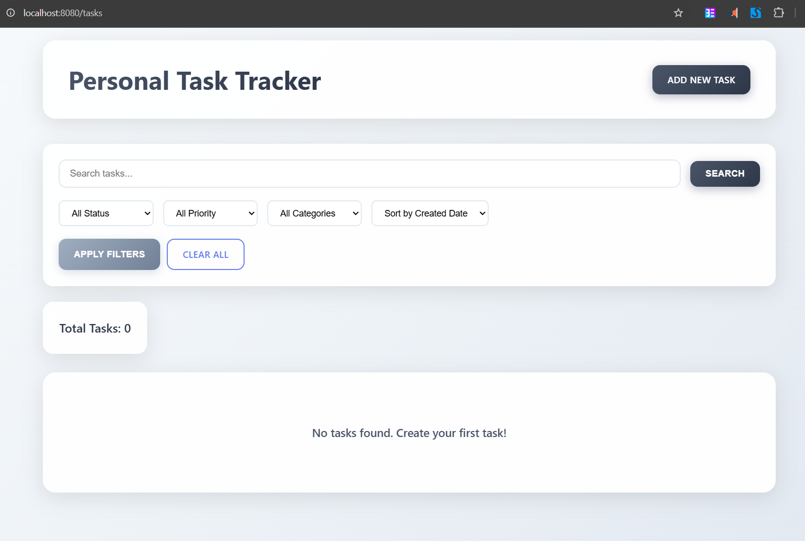
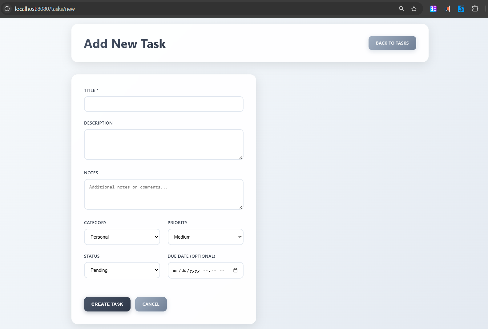
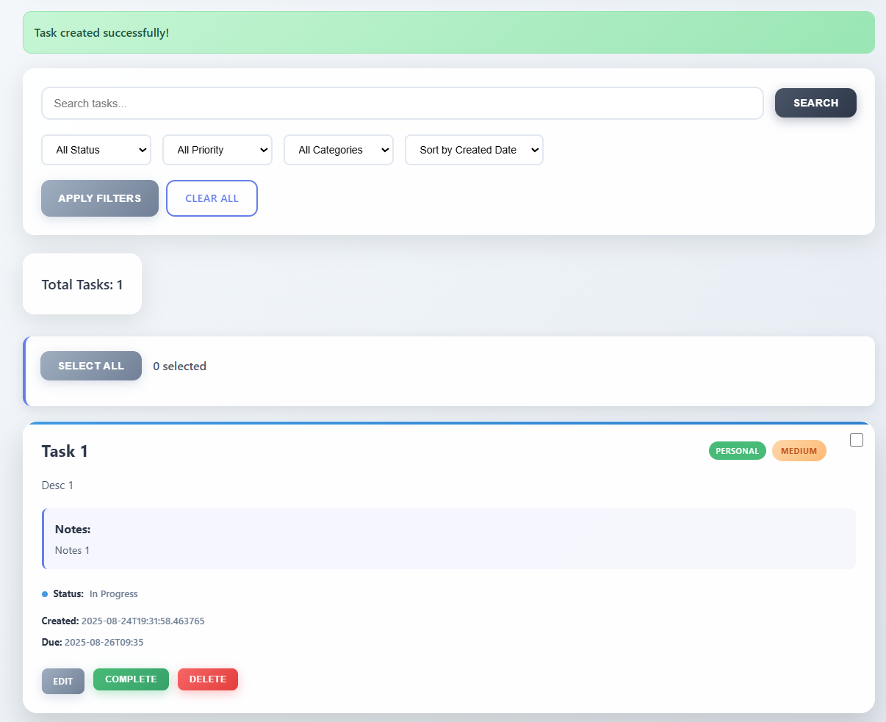

# Task Tracker

A personal To-Do List app built with Spring Boot, JSP, Maven, and H2 database.  
Allows you to manage, categorize, and filter your daily tasks.

## 2 Minute Live Demo Video

<https://youtu.be/L7ApUuiYNjE>

## Features

- Add, edit, delete, and complete tasks
- Filter & search by category, status, priority, and query
- Bulk selection and actions
- Beautiful and modern responsive UI
- Easy username-based "save/load" for persistent storage (future-proof)
- Built with Spring Boot, JSP, Java 17, and Maven

## Screenshots

### Home Page (All Tasks)

### Add Task Screen

### Task Appears in List

## Technologies Used

- Java 17+
- Spring Boot (Web, Data JPA)
- Maven
- JSP (JavaServer Pages)
- H2 Database (in-memory)
- Servlet/Jakarta API
- Modern CSS

## To run locally

- git clone https://github.com/SumedhKudale/todolistapp
- cd todolistapp
- mvn clean compile
- mvn spring-boot:run
- Check localhost:8080

## Credit

Designed and developed by [Sumedh Kudale](https://github.com/SumedhKudale)

---
